[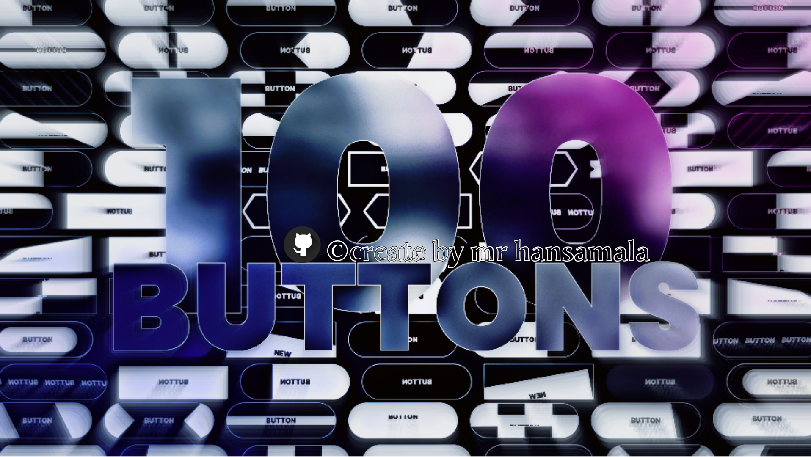](https://github.com/mrhansamala)

## 🚀️ We're on Product Hunt!

If you want me to keep making **amazing free resources** for you, I would *really appreaciate* your feedback and support🤗️

## 🤖️ To See Code, Click on One of The Links

| Preview | Link | Description |
| --- | --- | --- |
| [ 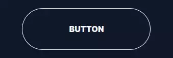](https://github.com/mrhansamala/basic) | [Basic](https://github.com/mrhansamala/basic) | CSS Button that changes color on click or hover. |
| [ 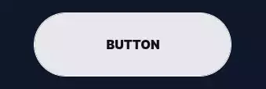](https://github.com/mrhansamala/inverted-triangles) | [Inverted Triangles](https://github.com/mrhansamala/inverted-triangles) | CSS Button slides its two inverted triangles to the middle on click or hover. |
|  | [Line Slide](https://github.com/mrhansamala/line-slide) | CSS Button that slides its pseudo-element underline on hover or click. |
|  | [Don't Cross The Line](https://github.com/mrhansamala/don't-cross-the-line) | CSS Button that crosses over itself and expands on hover or click. |
|  | [Slicer And Marquee](https://github.com/mrhansamala/slicer-and-marquee) | CSS Button that slices its background and cycles its content vertically on click or hover. |
| [ 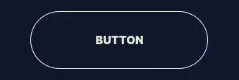](https://github.com/mrhansamala/zoom-in-and-text-rotate) | [Zoom In And Text Rotate](https://github.com/mrhansamala/zoom-in-and-text-rotate) | CSS Button that slides two inward-pointing pseudo-element triangles to the center on hover or click. |
| [ 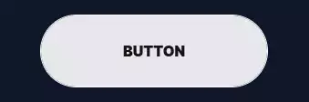](https://github.com/mrhansamala/alternate-blocks-and-text-flip) | [Alternate Blocks And Text Flip](https://github.com/mrhansamala/alternate-blocks-and-text-flip) | CSS Button that slides its four alternate blocks and flips its text vertically on click or hover. |
| [ 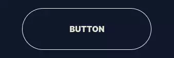](https://github.com/mrhansamala/slide-right) | [Slide Right](https://github.com/mrhansamala/slide-right) | CSS Button with background that slides right on click or hover. |
|  | [Tilted diagonal](https://github.com/mrhansamala/tilted-diagonal) | CSS Button that slides its increasingly tilted diagonal to the right on click or hover. |
|  | [In And Out](https://github.com/mrhansamala/in-and-out) | CSS Button that slides its background to the right on click or hover and more to the right again on click or hover. |
| [ 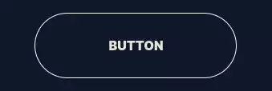](https://github.com/mrhansamala/bubble-right) | [Bubble Right](https://github.com/mrhansamala/bubble-right) | CSS Button that slides its circular background to the right on click or hover. |
|  | [Marquee Sign](https://github.com/mrhansamala/marquee-sign) | CSS Button that moves copies of its text horizontally and at an angle on click or hover. |
| [ 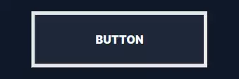](https://github.com/mrhansamala/shapeshifter) | [ShapeShifter](https://github.com/mrhansamala/shapeshifter) | CSS Button that morphs one side of its border into a triangle pseudo-element on click or hover. |
| [ 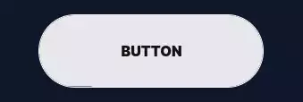](https://github.com/mrhansamala/click-to-fill) | [Click To Fill](https://github.com/mrhansamala/click-to-fill) | CSS Button with background that fills it up vertically on click. |
| [ 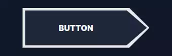](https://github.com/mrhansamala/double-shapeshifter) | [Double ShapeShifter](https://github.com/mrhansamala/double-shapeshifter) | CSS Button that morphs both sides into a triangle pseudo-element on click or hover. |
|  | [X ShapeShifter](https://github.com/mrhansamala/x-shapeshifter) | CSS Button that morphs into an X using pseudo-elements on click or hover. |
| [ 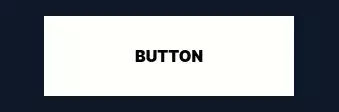](https://github.com/mrhansamala/fold-middle) | [Fold Middle](https://github.com/mrhansamala/fold-middle) | CSS Button that folds from the middle using CSS 3D Transforms on hover or click. |
| [ 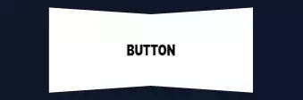](https://github.com/mrhansamala/fold-one-side) | [Fold One Side](https://github.com/mrhansamala/fold-one-side) | CSS Button that folds from one side using CSS 3D Transforms on hover or click. |
|  | [Arrow Slide + Text Rotate](https://github.com/mrhansamala/arrow-slide-+-text-rotate) | CSS Button that slides its triangular background from the left to the right and rotates its text on hover or click. |
| [ 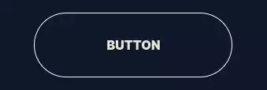](https://github.com/mrhansamala/slide-down) | [Slide Down](https://github.com/mrhansamala/slide-down) | CSS Button with backgrounds that slides down on click or hover. |
| [ 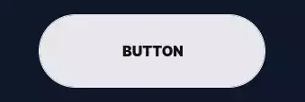](https://github.com/mrhansamala/bubble-up-+-text-rotate) | [Bubble Up + Text Rotate](https://github.com/mrhansamala/bubble-up-+-text-rotate) | CSS Button that slides its bubbly radial background to the bottom and rotates its text on hover or click. |
| [ 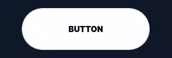](https://github.com/mrhansamala/overfold) | [OverFold](https://github.com/mrhansamala/overfold) | CSS Button that moves one corner from the bottom right to the top left to reveal its background on hover or click. |
| [ 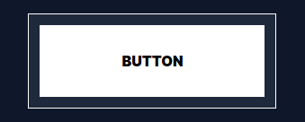](https://github.com/mrhansamala/focus-in) | [Focus In](https://github.com/mrhansamala/focus-in) | CSS Button that focuses its border in on hover or click. |
|  | [Cover Over](https://github.com/mrhansamala/cover-over) | CSS Button that has a pseudo-element background going over it and out on hover or click. |
| [ 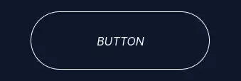](https://github.com/mrhansamala/enlarge) | [Enlarge](https://github.com/mrhansamala/enlarge) | CSS Button that fills up its background radially from the center and scales up on hover or click. |
|  | [Slanted](https://github.com/mrhansamala/slanted) | CSS Button that tilts its background from the top left corner on hover or click. |
| [ 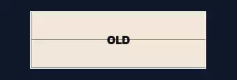](https://github.com/mrhansamala/split-reveal) | [Split Reveal](https://github.com/mrhansamala/split-reveal) | CSS Button that reveals new text by splitting it horizontally from the center on hover or click. |
|  | [Split Reveal Alternate](https://github.com/mrhansamala/split-reveal-alternate) | CSS Button that reveals new text by splitting it alternately from the center on hover or click. |
|  | [Split Reveal Horizontal](https://github.com/mrhansamala/split-reveal-horizontal) | CSS Button that reveals new text by splitting it horizontally from the center on hover or click. |
|  | [Slide Reveal](https://github.com/mrhansamala/slide-reveal) | CSS Button that reveals new text by sliding it to the right on hover or click. |
|  | [Diagonal Swipe](https://github.com/mrhansamala/diagonal-swipe) | CSS Button that slides its diagonal background to the right on click or hover. |
| [ 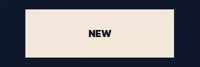](https://github.com/mrhansamala/slide-reveal-+-text-down) | [Slide Reveal + Text Down](https://github.com/mrhansamala/slide-reveal-+-text-down) | CSS Button that reveals new text by sliding it to the right and sliding the old text down on hover or click. |
| [ 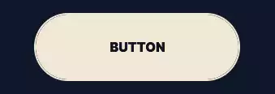](https://github.com/mrhansamala/pill-shrink) | [Pill Shrink](https://github.com/mrhansamala/pill-shrink) | CSS Button that scales its pill-like background down on hover or click. |
| [ 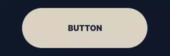](https://github.com/mrhansamala/pill-halo) | [Pill Halo](https://github.com/mrhansamala/pill-halo) | CSS Button that focuses in its pill-like border on hover or click. |
|  | [Glow Button](https://github.com/mrhansamala/glow-button) | CSS Button that has a moving and glowing border on hover or click. |
| [ 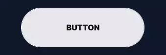](https://github.com/mrhansamala/rotate-reveal) | [Rotate Reveal](https://github.com/mrhansamala/rotate-reveal) | CSS Button that reveals new text by rotating it in from the bottom left on hover or click. |
| [ 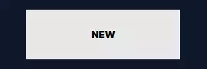](https://github.com/mrhansamala/double-slide-down) | [Double Slide Down](https://github.com/mrhansamala/double-slide-down) | CSS Button that slides its two backgrounds successively to the bottom on hover or click. |
|  | [Double Slide Right](https://github.com/mrhansamala/double-slide-right) | CSS Button that slides its two backgrounds successively to the right on hover or click. |
| [ 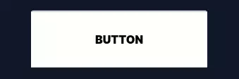](https://github.com/mrhansamala/3d-rotate-down) | [3D Rotate Down](https://github.com/mrhansamala/3d-rotate-down) | CSS Button that rotates down using 3D Transforms on hover or click. |
| [ 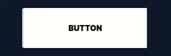](https://github.com/mrhansamala/3d-rotate-right) | [3D Rotate Right](https://github.com/mrhansamala/3d-rotate-right) | CSS Button that rotates right using 3D Transforms on hover or click. |
|  | [3D Rotate Left](https://github.com/mrhansamala/3d-rotate-left) | CSS Button that rotates left using 3D Transforms on hover or click. |
|  | [3D Rotate Down](https://github.com/mrhansamala/3d-rotate-down) | CSS Button that rotates up using 3D Transforms on hover or click. |
| [ 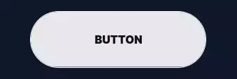](https://github.com/mrhansamala/rush-triangle) | [Rush Triangle](https://github.com/mrhansamala/rush-triangle) | CSS Button that slides its triangular background to the right on click or hover. |
| [ 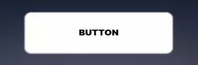](https://github.com/mrhansamala/3d-float) | [3D Float](https://github.com/mrhansamala/3d-float) | CSS Button that has a large box shadow and that tilts down using 3D Transforms on hover or click. |
| [ 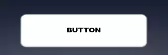](https://github.com/mrhansamala/3d-button-click) | [3D Button Click](https://github.com/mrhansamala/3d-button-click) | CSS Button that pushes itself down in 3D space on hover or click. |
| [ 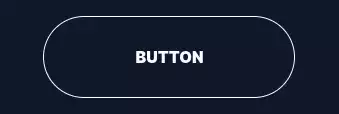](https://github.com/mrhansamala/striped-zebra) | [Striped Zebra](https://github.com/mrhansamala/striped-zebra) | CSS Button with striped background that scrolls on click or hover. |
|  | [Letter Dance](https://github.com/mrhansamala/letter-dance) | CSS Button that slides its characters down successively one after the other on hover or click. |
|  | [Letter Dance 2](https://github.com/mrhansamala/letter-dance-2) | CSS Button that slides its characters up and down alternately on hover or click. |
|  | [3D Button 2](https://github.com/mrhansamala/3d-button-2) | CSS Button that simulates 3D using html elements and that pushes down on hover or click. |
| [ 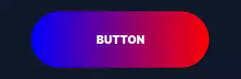](https://github.com/mrhansamala/rainbow-fill) | [Rainbow Fill](https://github.com/mrhansamala/rainbow-fill) | CSS Button that reveals its fun rainbow gradient background sitting inside of its rainbow gradient image border on hover or click. |
|  | [Pulse](https://github.com/mrhansamala/pulse) | CSS Button that pulsates on hover on hover or click. |
| [ 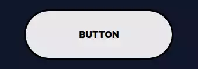](https://github.com/mrhansamala/offset) | [Offset](https://github.com/mrhansamala/offset) | CSS Button that moves its background back into-place on hover or click. |
|  | [Backdrop Blur](https://github.com/mrhansamala/backdrop-blur) | CSS Button that overlays a blurry layer on its background on hover or click. |
| [ 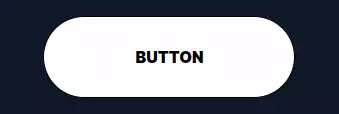](https://github.com/mrhansamala/tada) | [Tada](https://github.com/mrhansamala/tada) | CSS Button that plays the TADA animation from animate.css on hover or click. |
| [ 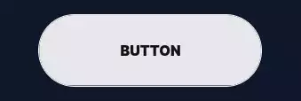](https://github.com/mrhansamala/double-horizontal) | [Double Horizontal](https://github.com/mrhansamala/double-horizontal) | CSS Button that slides its two backgrounds horizontally to the middle on click or hover. |
|  | [Jello](https://github.com/mrhansamala/jello) | CSS Button that plays the jello animation from animate.css on hover or click. |
| [ 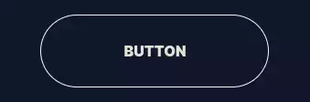](https://github.com/mrhansamala/alternate-blocks) | [Alternate Blocks](https://github.com/mrhansamala/alternate-blocks) | CSS Button with four blocks on alternate sides that move to the center on click or hover. |
|  | [Rubberband](https://github.com/mrhansamala/rubberband) | CSS Button that plays the rubberband animation from animate.css on hover or click. |
|  | [Wobble](https://github.com/mrhansamala/wobble) | CSS Button that plays the wobble animation from animate.css on hover or click. |
|  | [Head Shake](https://github.com/mrhansamala/head-shake) | CSS Button that plays the head-shake animation from animate.css on hover or click. |
|  | [Heart Beat](https://github.com/mrhansamala/heart-beat) | CSS Button that plays the heart-beat animation from animate.css on hover or click. |
|  | [Flash](https://github.com/mrhansamala/flash) | CSS Button that plays the flash animation from animate.css on hover or click. |
| [ 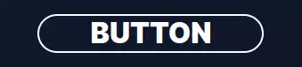](https://github.com/mrhansamala/text-slide) | [Text Slide](https://github.com/mrhansamala/text-slide) | CSS Button that slides a copy of its text vertically with another color on hover or click. |
|  | [Border Snake](https://github.com/mrhansamala/border-snake) | CSS Button that has borders that fill-up one after another on hover or click. |
|  | [Snakes Alternate](https://github.com/mrhansamala/snakes-alternate) | CSS Button that has borders filling up from the parallel sides on hover or click. |
|  | [Snakes Meet](https://github.com/mrhansamala/snakes-meet) | CSS Button that has borders filling up to meet at 2 points on hover or click. |
| [ 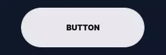](https://github.com/mrhansamala/double-vertical) | [Double Vertical](https://github.com/mrhansamala/double-vertical) | CSS Button with two backgrounds that slide vertically to the center on click or hover. |
|  | [Quadruple Corners](https://github.com/mrhansamala/quadruple-corners) | CSS Button with 4 corners that all converge to the middle on click or hover. |
|  | [Snakes Center](https://github.com/mrhansamala/snakes-center) | CSS Button that has borders filling up from the center on hover or click. |
|  | [Material Ripple](https://github.com/mrhansamala/material-ripple) | CSS Button that fills up its background radially from the center then fades out on hover or click. |
| [ 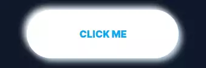](https://github.com/mrhansamala/neumorphism-1) | [Neumorphism 1](https://github.com/mrhansamala/neumorphism-1) | CSS Button that has a fluffy shadow that moves to the inside on hover or click. |
| [ 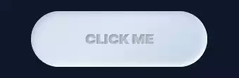](https://github.com/mrhansamala/neumorphism-2) | [Neumorphism 2](https://github.com/mrhansamala/neumorphism-2) | CSS Button that has a fluffy shadow and text with a 3D effect using text shadows and that moves to the inside on hover or click. |
| [ 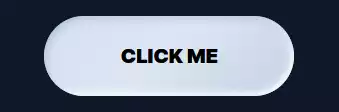](https://github.com/mrhansamala/neumorphism-3) | [Neumorphism 3](https://github.com/mrhansamala/neumorphism-3) | CSS Button that has a fluffy shadow that smoothly moves to the inside on hover or click. |
| [ 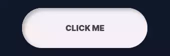](https://github.com/mrhansamala/neumorphism-4) | [Neumorphism 4](https://github.com/mrhansamala/neumorphism-4) | CSS Button that moves down on hover or click. |
|  | [Neon](https://github.com/mrhansamala/neon) | CSS Button that has borders filling up slowly then revealing a large neon shadow on hover or click. |
|  | [I Want Attention](https://github.com/mrhansamala/i-want-attention) | CSS Button that keeps pulsing on hover or click. |
|  | [Hug](https://github.com/mrhansamala/hug) | CSS Button that moves its background from the outside to the inside on hover or click. |
|  | [Hug 2](https://github.com/mrhansamala/hug-2) | CSS Button that moves its background closer from the outside to the inside on hover or click. |
| [ 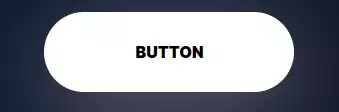](https://github.com/mrhansamala/float-up) | [Float Up](https://github.com/mrhansamala/float-up) | CSS Button that floats up with a box shadow below it on click or hover. |
| [ 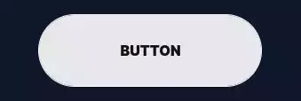](https://github.com/mrhansamala/double-diagonal) | [Double Diagonal](https://github.com/mrhansamala/double-diagonal) | CSS Button that slides its two diagonal backgrounds horizontally to the center on click or hover. |
| [ 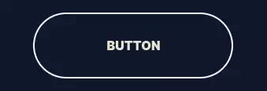](https://github.com/mrhansamala/progress-fill-right) | [Progress Fill Right](https://github.com/mrhansamala/progress-fill-right) | CSS Button that has a background that slowly fills up with a progress animation on hover or click. |
|  | [Progress Fill Up](https://github.com/mrhansamala/progress-fill-up) | CSS Button that has a background that slowly fills up vertically on hover or click. |
| [ 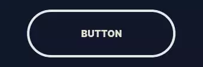](https://github.com/mrhansamala/progress-shrink-vertical) | [Progress Shrink Vertical](https://github.com/mrhansamala/progress-shrink-vertical) | CSS Button that shrinks into a progress-bar vertically on hover or click. |
| [ 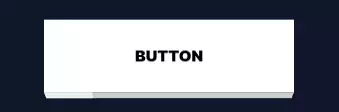](https://github.com/mrhansamala/3d-progress) | [3D Progress](https://github.com/mrhansamala/3d-progress) | CSS Button that tilts in 3D space to reveal a horizontal progress-bar on hover or click. |
|  | [Elastic Progress](https://github.com/mrhansamala/elastic-progress) | CSS Button that shrinks into a horizontal progress-bar in a smooth and elastic animation on hover or click. |
| [ 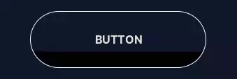](https://github.com/mrhansamala/letter-dance-3) | [Letter Dance 3](https://github.com/mrhansamala/letter-dance-3) | CSS Button that double-fills its background and plays an elastic animation with its characters on hover or click. |
|  | [Circular Charge](https://github.com/mrhansamala/circular-charge) | CSS Button that has a circular border that is clipped and fills up then fills up the background on hover or click. |
|  | [Icon Pulse](https://github.com/mrhansamala/icon-pulse) | CSS Button that scales its background like a pulse on hover or click. |
| [ 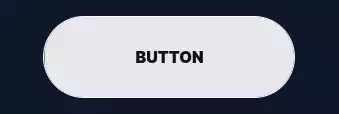](https://github.com/mrhansamala/slicer) | [Slicer](https://github.com/mrhansamala/slicer) | CSS Button that slices its background in half on click or hover. |
|  | [Icon Slide](https://github.com/mrhansamala/icon-slide) | CSS Button that slides vertically inside its borders on hover or click. |
| [ 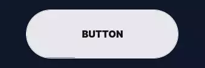](https://github.com/mrhansamala/double-triangle) | [Double Triangle](https://github.com/mrhansamala/double-triangle) | CSS Button that slides its two triangular backgrounds horizontally to the center on click or hover. |
|  | [Gooey](https://github.com/mrhansamala/gooey) | CSS Button that moves two circles closer to each other that have a gooey and slimy effect on hover or click. |
| [ 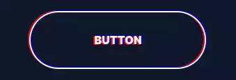](https://github.com/mrhansamala/seizure-glitch) | [Seizure Glitch](https://github.com/mrhansamala/seizure-glitch) | CSS Button that plays an RGB split animation on hover or click. |
| [ 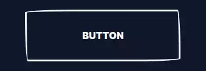](https://github.com/mrhansamala/handdrawn-1) | [HandDrawn 1](https://github.com/mrhansamala/handdrawn-1) | CSS Button that has borders mimicking hand-drawn edges on hover or click. |
|  | [HandDrawn 2](https://github.com/mrhansamala/handdrawn-2) | CSS Button that has borders mimicking hand-drawn edges and floats up on hover or click. |
|  | [Icon Zoom](https://github.com/mrhansamala/icon-zoom) | CSS Button that scales down inside its borders on hover or click. |
|  | [Icon Focus](https://github.com/mrhansamala/icon-focus) | CSS Button that has a border scaling in on it on hover or click. |
|  | [Progress Fold](https://github.com/mrhansamala/progress-fold) | CSS Button that paper-folds one side to reveal a progress-bar on hover or click. |
|  | [Sandwish](https://github.com/mrhansamala/sandwish) | CSS Button that moves up many shadows successively on hover or click. |
